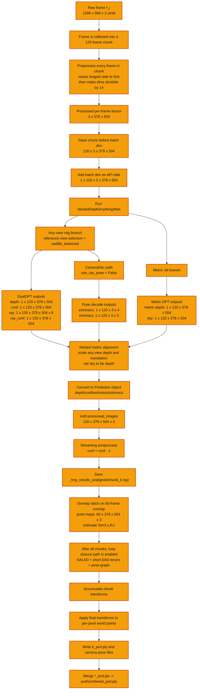
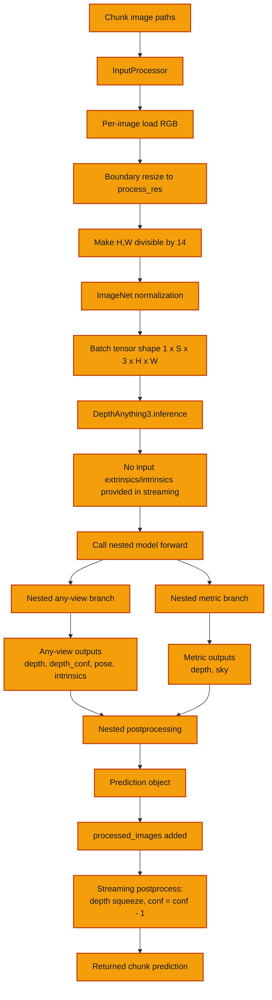
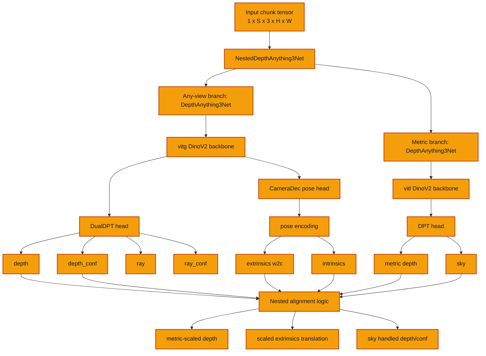
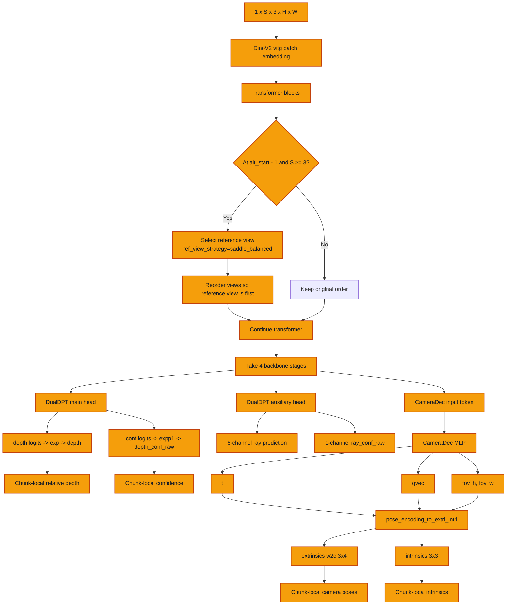
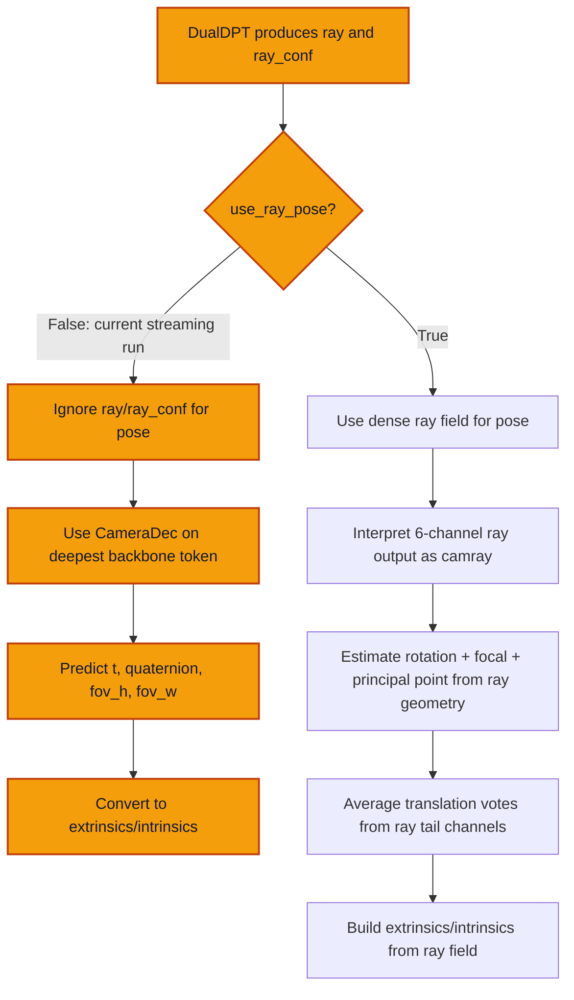
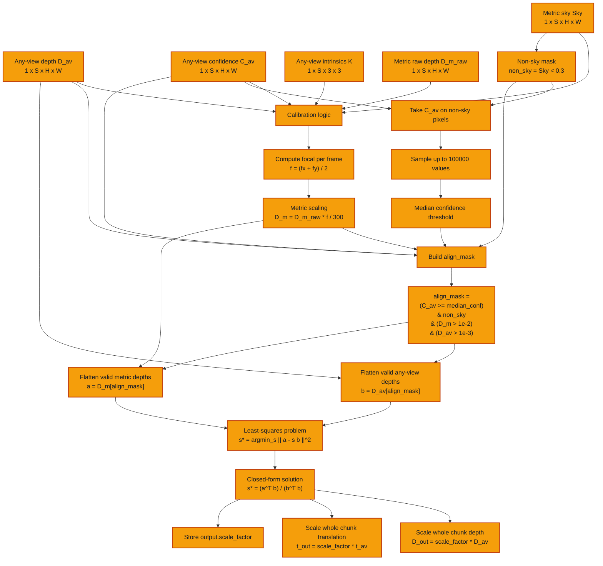
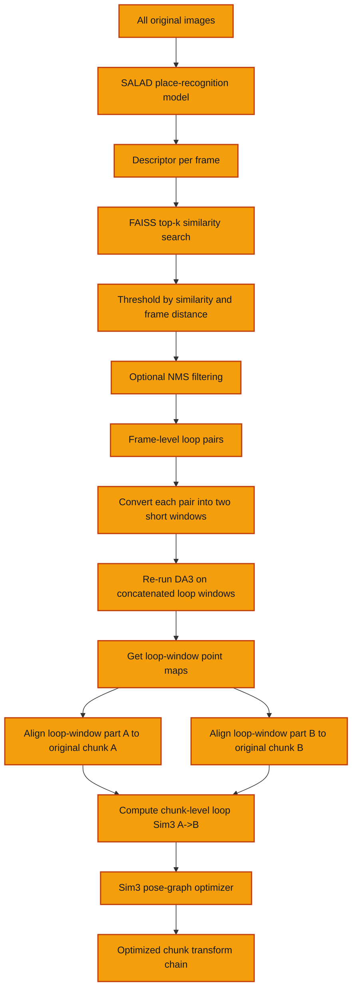
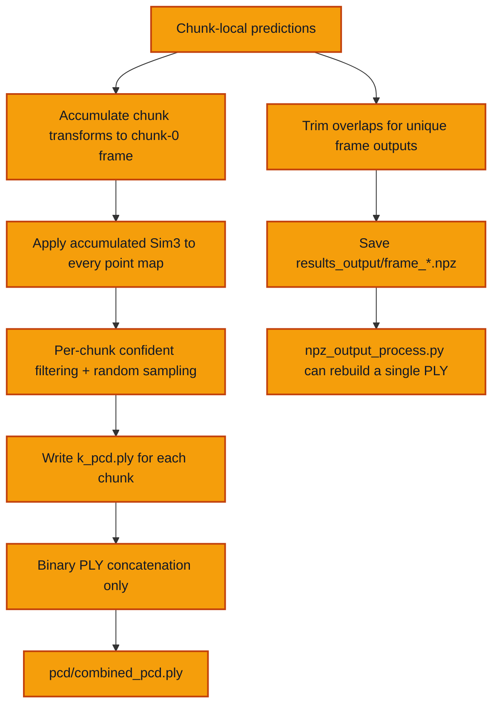

# DA3-Streaming Architecture Notes

This document reflects the code paths in:

- `da3_streaming/da3_streaming.py`
- `src/depth_anything_3/model/da3.py`
- `src/depth_anything_3/model/dualdpt.py`
- `src/depth_anything_3/model/dpt.py`
- `src/depth_anything_3/model/dinov2/vision_transformer.py`
- `da3_streaming/loop_utils/*`

It is written specifically for the current streaming pipeline used by:

```bash
python3 da3_streaming.py --image_dir ... --config ./configs/base_config.yaml --output_dir ...
```

In every Mermaid diagram below, orange nodes mark the blocks used by the current code path for this streaming run:

- `base_config.yaml`
- `use_ray_pose=False`
- `loop_enable=True`
- `ref_view_strategy=saddle_balanced`

## 1. High-Level Streaming Pipeline

```mermaid
flowchart TD
    A[Image directory] --> B[Sort *.jpg/*.png into img_list]
    B --> C[Split sequence into overlapping chunks<br/>chunk_size=120, overlap=60]

    C --> D[For each chunk]
    D --> E[Preprocess chunk images<br/>resize, make dims divisible by 14, normalize]
    E --> F[Run DA3 nested model on whole chunk]
    F --> G[Chunk-local outputs<br/>depth, conf, extrinsics, intrinsics, processed_images]
    G --> H[Save raw chunk prediction to _tmp_results_unaligned/chunk_k.npy]

    H --> I{Previous chunk exists?}
    I -->|No| J[Continue]
    I -->|Yes| K[Take overlapping frames only<br/>prev tail 60, current head 60]
    K --> L[Convert overlap depth+pose to chunk-local point maps]
    L --> M[Estimate relative chunk Sim3<br/>current chunk -> previous chunk]
    M --> N[Append to sequential sim3_list]
    N --> J

    J --> O{All chunks processed?}
    O -->|No| D
    O -->|Yes| P{loop_enable == True?}

    P -->|No| Q[Skip loop closure]
    P -->|Yes| R[Run SALAD loop detector on entire image sequence]
    R --> S[Get frame-level loop pairs]
    S --> T[Convert each pair into two short frame windows]
    T --> U[Re-run DA3 on each loop window pair]
    U --> V[Estimate loop Sim3 constraints between chunks]
    V --> W[Sim3 pose-graph optimization over chunk chain]
    W --> Q

    Q --> X[Accumulate chunk transforms to chunk-0 world]
    X --> Y[Apply accumulated Sim3 to every chunk point map]
    Y --> Z[For each chunk:<br/>save chunk PLY and optionally save unique frame NPZs]
    Z --> AA[Save camera_poses.txt, intrinsic.txt, camera_poses.ply]
    AA --> AB[Delete temporary chunk files if enabled]
    AB --> AC[Merge all *_pcd.ply files into pcd/combined_pcd.ply]

    classDef active fill:#f59e0b,stroke:#c2410c,stroke-width:2px,color:#111827;
    class A,B,C,D,E,F,G,H,I,K,L,M,N,J,O,P,R,S,T,U,V,W,Q,X,Y,Z,AA,AB,AC active;
```



## 2. Exact Current Frame/Chunk Path

This diagram shows the concrete path for a frame processed inside a non-initial chunk `k > 0`. For chunk `0`, the overlap-stitch node is skipped.



## 3. What Happens Inside One Chunk Inference



## 4. Nested Model Architecture



## 5. Any-View Branch Detail



## 6. Pose Path: Camera Decoder vs Ray Pose

In the current streaming code, `use_ray_pose` is not passed to `model.inference`, so it uses the API default `False`. That means the active path is the camera decoder path, not the ray-pose path.



## 7. Metric Branch and Nested Postprocessing

```mermaid
flowchart TD
    A[Any-view outputs:<br/>depth, depth_conf, extrinsics, intrinsics] --> G[Nested postprocess]
    B[Metric outputs:<br/>depth, sky] --> G

    G --> H[Scale metric depth by focal / 300]
    H --> I[Compute non_sky_mask from metric sky < 0.3]
    A --> J[Take any-view depth_conf over non-sky]
    J --> K[Median confidence threshold]
    I --> L[Build alignment mask:<br/>non-sky, confident, positive depths]
    H --> L
    A --> L

    L --> M[Least-squares problem<br/>s* = argmin_s || D_m[align_mask] - s D_av[align_mask] ||^2]
    M --> N[Scale any-view depth by scale_factor]
    M --> O[Scale any-view extrinsics translation by scale_factor]
    B --> P[Use sky mask to set sky depth to far value]
    P --> Q[Set sky confidence to 1.0]

    N --> R[Final nested metric depth]
    O --> S[Final nested metric-scaled poses]
    Q --> T[Final nested sky-handled confidence]

    classDef active fill:#f59e0b,stroke:#c2410c,stroke-width:2px,color:#111827;
    class A,B,G,H,I,J,K,L,M,N,O,P,Q,R,S,T active;
```

## 8. Exact Metric Calibration Pipeline

This calibration happens once per nested forward call, so in the current streaming run it is one scalar per chunk, not one scalar per frame.



## 9. Chunk-to-Chunk Alignment

```mermaid
flowchart TD
    A[Previous chunk prediction] --> C[Take overlap tail]
    B[Current chunk prediction] --> D[Take overlap head]

    C --> E[depth + intrinsics + extrinsics -> point_map_prev]
    D --> F[depth + intrinsics + extrinsics -> point_map_cur]

    E --> G[Keep pixels where both confidences are high]
    F --> G
    G --> H[Weight correspondences by sqrt(conf_prev * conf_cur)]
    H --> I[Robust weighted Sim3 alignment<br/>cur -> prev]
    I --> J[Output relative s, R, t]
    J --> K[Append to sim3_list]

    classDef active fill:#f59e0b,stroke:#c2410c,stroke-width:2px,color:#111827;
    class A,B,C,D,E,F,G,H,I,J,K active;
```

## 10. Loop Closure Detail



## 11. Final Point Cloud Export



## 12. Important Practical Notes

- The streaming pipeline is not doing TSDF fusion, voxel fusion, surfel fusion, ICP map fusion, or bundle adjustment over all frames.
- The final `combined_pcd.ply` is produced by merging per-chunk PLY files, not by re-optimizing or deduplicating all 3D points.
- Overlap regions are duplicated in the chunk PLY export path, because each chunk PLY is written from the full aligned chunk. The `results_output/frame_*.npz` path trims overlaps and keeps each frame once.
- Loop closure is optional and controlled by `Model.loop_enable`.
- In the default streaming path, pose comes from `CameraDec`, because `use_ray_pose=False`.
- The nested model already outputs metric depth per chunk, but the streaming stitcher still estimates chunk-to-chunk Sim3, including scale, to align chunk coordinate systems.
